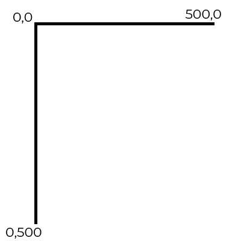
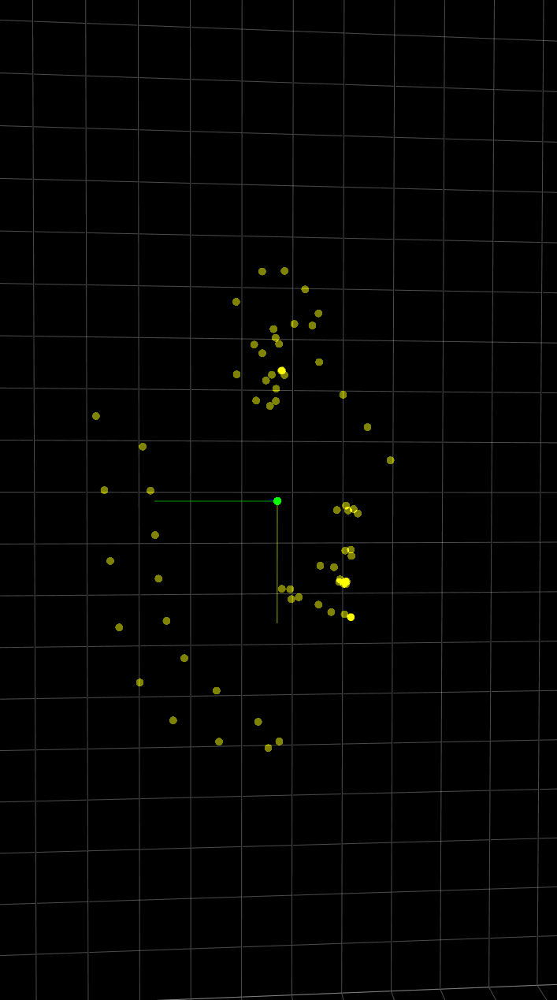
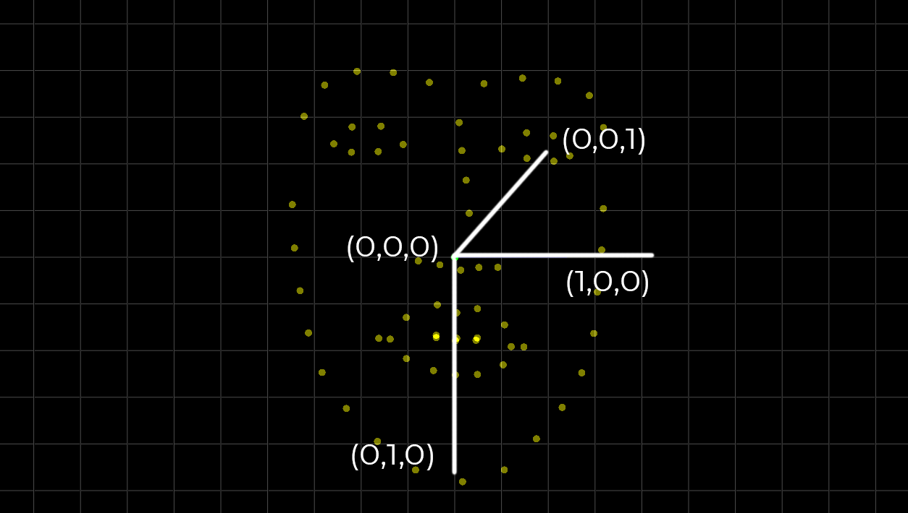
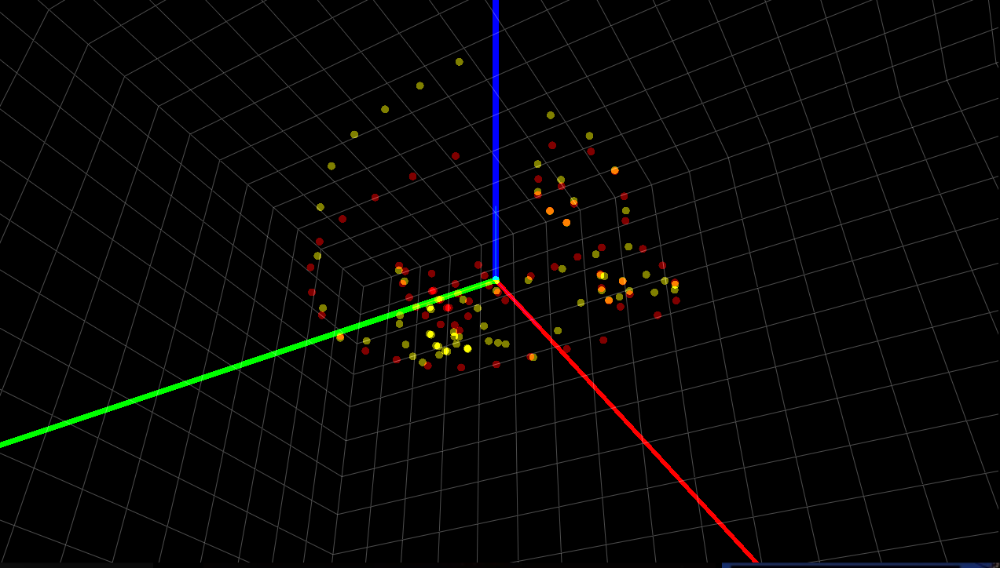
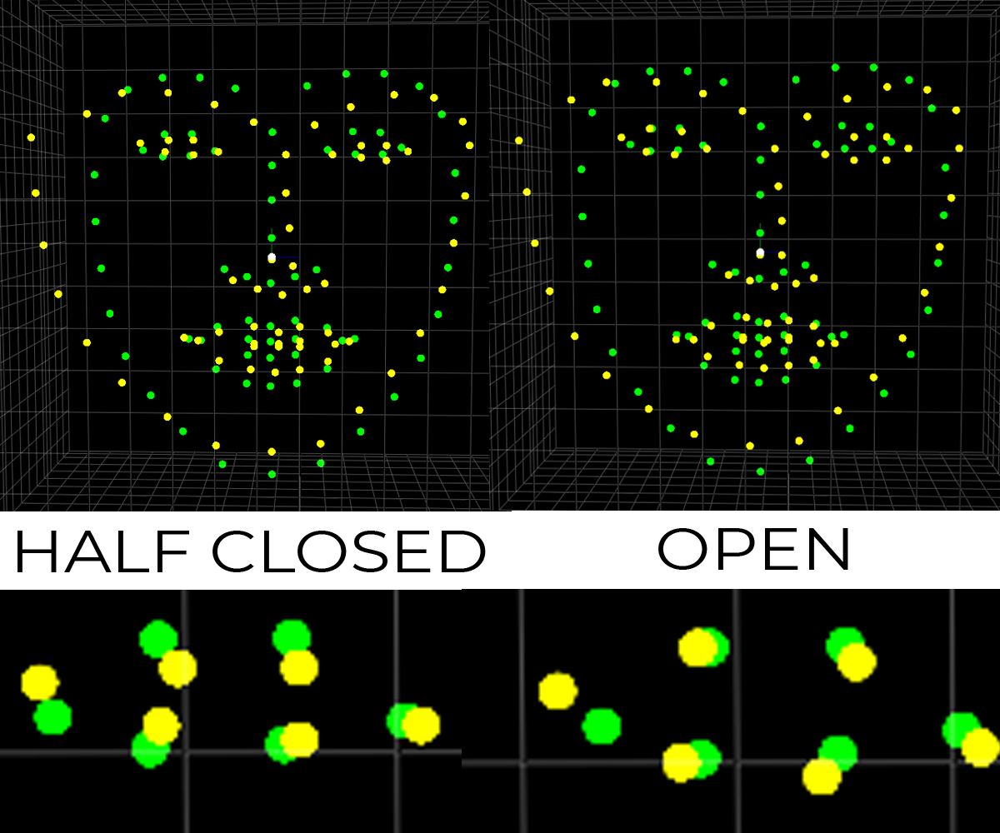

# Teyered

Machine Learning and Computer Vision framework for tiredness detection.

## Table of Contents

- [Example](#Example)
- [Facial features extraction](#Facial-features-extraction)
- [Coordinate systems and Camera](#Coordinate-systems-and-Camera)
- [Face model](#Face-model)
- [Head pose estimation](#Head-pose-estimation)
- [Normalization of eye points](#Normalization-of-eye-points)
- [3D visualization software](#3D-visualization-software)
- [Team](#Team)

## Example

Assuming that the video is loaded and analysed in batches (where batch is a list of consecutive frames):

```python
from teyered.teyered_processor import TeyeredProcessor

processor = TeyeredProcessor()

# Load frame batches in your preferred way
for batch in video1:
    # Processing output defined by teyered.teyered_processor.ProcessingOutput
    processing_output = processor.process(batch)
    # Blink detection
    # Do further analysis/save info from the batch
    
# Reset processor before analysing another video
processor.reset()

for batch in video2:
    processing_output = processor.process(batch)
    # ...
```

## Facial features extraction

We combine CNN facial points detection and Lukas-Kanade optical flow tracker to extract the most accurate representation of facial features at any point in time. Noise of the facial landmarks data was partially due to the fact that the facial features are only detected and never tracked.

Detected means that we detect facial features in each frame indepentently of previous frames. Thus, facial features points are not necessarily "the same points" throughout consecutive pictures. 

Tracking means using something like Lukas-Kanade optical flow tracker. This gives us (nearly) the same matching points for consecutive frames, thus way less noise, which is later an important factor for estimating pose. Another reason for using tracking is that it should be less computationally costly than detection.

### LK tracking

The idea is as follows: take two consecutive frames and the detected points in the first frame. Then identify the same points in the second frame and find the displacement (change) between the two frames. Example:

<p align="center">
    
</p>

Our implementation uses `cv2.calcOpticalFlowPyrLK()` which calculates an optical flow for a sparse feature set using the iterative Lucas-Kanade method with pyramids. Currently if any of the points gets lost in the tracking process, redetect all of them.

### TODO

- Apply filtering (for example Kalman)
- Try out different redetection possibilities (based on relative error)
- Try out different tracking algorithms

## Coordinate systems and Camera

Different coordinate systems (different frames of reference):

* **Model (object)** - local coordinate system for a single object
* **World** - co-relating objects in 3D world. We bring objects from model to world coordinates.

<p align="center">
    
</p>

* **Camera** - co-relating objects in 3D world with respect to the camera
* **Image** - co-relating objects when they're projected onto a 2D plane. The relationship between  these two looks as follows:

<p align="center">
    
</p>

We assume pinhole camera model and use perspective transformation - converting points form world coordinates to image:

<p align="center">
    
</p>

Rotation/translation of the object from world coordinates to camera coordinates form a matrix of **extrinsic parameters**. Describes camera motion around a static scene or a rigid motion of an object in front of a still camera.

Camera has its own **intrinsic parameters** - focal length, optical center and distortion coefficient. These can be either provided by the camera manufacturer (known) or we can obtain them by calibrating the camera. These never change as opposed to extrinsic parameters (unless we zoom in, then the focal length can change)

### TODO 

- Currently, we're using approximation of the intrinsic parameters from https://www.learnopencv.com/approximate-focal-length-for-webcams-and-cell-phone-cameras/. Custom calibration using the provided class and proper calibration images should give better results than current approximation. I personally use MacBook Pro built-in camera, its parameters are not disclosed by Apple afaik. More accurate camera parameters - more accurate head pose estimation.

## Face model

We, just like `dlib`, use the following 2D and 3D face models:

<p align="center">
    
</p>

* **Jaw:** [1-17]
* **Left eyebrow:** [18-22]
* **Right eyebrow:** [23-27]
* **Nose:** [28-36] (**tip of the nose:** 31)
* **Left eye:** [37-42]
* **Right eye:** [43-48]
* **Mouth:** [49-68]

From a person's perspective, your right eye is left eye in this diagram.

Image plane coordinates are as follows (pixels):

<p align="center">
    
</p>


We use 3D face model from <a href="https://github.com/TadasBaltrusaitis/OpenFace">here</a> (we will need to develop our own version as the license is incorrect for us).

<p align="center">
    
</p>

The following are the `face_model.txt` coordinates:

<p align="center">
    
</p>

Thus, to plot the head pose orientation in a "human friendly way", we plot lines from `(0,0,0)` to `(1,0,0)`, `(0,-1,0)` and `(0,0,-1)` in both 2D and 3D. No transformation would mean having 0&deg; pitch, roll and yaw.

The following are the `face_model.txt` (yellow) and 2D facial points (red) on image plane coordinates to illustrate the relation:

<p align="center">
    
</p>

* Red: x-axis
* Green: y-axis
* Blue - z-axis

We could rotate both facial points and model points 180&deg; around x-axis (red) to get a more "human readable and intuitive" representation of both angles and axis, but this is not necessary. Model is adjusted according to the way image plane works (and thus facial points are obtained).

### Processing face model

Optimization to the generic 3D face model should be done, so that the shape resembles the one of the person (for example: eye width, eye-nose-eye distance etc.). This could be done using one or several photos of different angles of a person

### TODO

- Implement 3D face model optimization

## Head pose estimation

We use a single monocular RGB camera to accurately track the 3D position and rotations of the face in space. While this, in principle, is a simple PnP problem, we combine facial features extraction and tuned PnP algorithm to achieve high accuracy. To estimate head pose, we need:

* 2D image plane coordinates of the facial landmarks (we get this from `points_extractor.py`).
* 3D model/world coordinates of the face.

Points we currently use for head pose estimation (these are the points which we assume only change when head pose changes):

* **Jaw:** [1-17]
* **Nose:** [28-36]
* **Left eye (corners):** 37, 40
* **Right eye (corners):** 43, 46
* **Mouth (corners):** 49, 55

Thus, other points are assumed to have no effect on head pose and could be changed at static head pose (for example - moving eyebrows up and down while not moving the head).

### PnP problem

Rotation and translation vectors (**extrinsic parameters**) together with camera parameters (**intrinsic parameters**) bring the object from its 3D model/world coordinates to 3D camera coordinates (and then this would get projected to the image plane to get the actual image). Maths behind PnP are explained <a href="https://docs.opencv.org/3.0-beta/modules/calib3d/doc/camera_calibration_and_3d_reconstruction.html">in opencv docs</a>. This typically involves iterative calculations and the result isn't 100% accurate because of the nature of the equation (the algorithm is minimizing the reprojection error). We use `cv2.solvePnP()` method - to achieve better accuracy, when possible, we pass previous frame's rotation and translation vector and use what is called extrinsic guess.

### Rotation matrix vs. rotation vector

Rotation vector is a convenient and most compact representation of a rotation matrix (since any rotation matrix has just 3 degrees of freedom). The direction of that vector indicates the axis of rotation, while the length (or “norm”) of the vector gives the angle. A good description of this is this <a href="https://stackoverflow.com/a/13824496/7343355">stackoverflow answer</a>. Basically, it is an example of axis-angle representation (image below) and we may want to convert from this representation to rotation matrix and then euler angles (human readability or other reasons). More on this <a href="https://en.wikipedia.org/wiki/Rotation_formalisms_in_three_dimensions">here</a>. Thus, we just use in-built function `cv2.Rodrigues()` to convert to matrix.

<p align="center">
    
</p>

### Euler angles

Our implementation uses `cv2.decomposeProjectionMatrix()` method to get euler angles from rotation matrix. `cv2.decomposeProjectionMatrix()` computes a decomposition of a projection matrix into a calibration and a rotation matrix and the position of a camera. It also gives Euler angles - order is not specified, I got it from <a href="https://answers.opencv.org/question/16796/computing-attituderoll-pitch-yaw-from-solvepnp/?answer=52913#post-id-52913">here</a>. Projection matrix - 3x4 matrix obtained by multiplying camera matrix by [rotation|translation] matrix, described <a href="https://answers.opencv.org/question/13545/how-to-obtain-projection-matrix/">here</a>

<p align="center">
    
</p>

### Camera world coordinates 

Our implementation provides a way to get camera's position in world coordinates. <a href="https://answers.opencv.org/question/133855/does-anyone-actually-use-the-return-values-of-solvepnp-to-compute-the-coordinates-of-the-camera-wrt-the-object-in-the-world-space/">Link to the explanation</a>. Basically "the return values from `cv2.solvePnP()` are the rotation and translation of the object in camera coordinate system." We can use these return values to compute camera pose w.r.t. the object in the world space: invert the rotation (transpose), then the translation is the negative of the rotated translation. For example, if the object is static and the camera is moving, we can use this to determine the camera movement.

### TODO 

- Try stereo camera setup for head pose estimation for higher accuracy. This would also be useful when determining shape of the head etc.
- Play with pose estimation parameters and pose points to increase accuracy
- Try out different pose estimation algorithms
- Try to account for opening of the mouth (jaw points are also affected)
- Check the order of Euler angles (pretty sure yaw, pitch, roll are ZYX)
- Sometimes `pose.py` gives wrong rotation values - roll is around 180&deg; instead of 0&deg; which doesn't make any sense. This was discussed in several forums.

## Normalization of eye points

This is the core algorithm of the eye closedness detection.

Eye area depends on various factors that are impossible to control, such as the parameters of the camera, head movement, natural eye shape and closeness to the screen to name a few. To solve this problem, we came up with an algorithm that accounts for all of this and can be used to compare person's eyes in different environments.

### Idea

We need to connect head pose with eye area estimation. This could be done by measuring the percentage difference of the "closedness" of the eyes (how much the area differs from what we percieve to be the normal 100% area). 

1. We need "ground truth" of eye closedness - for development purposes, we will just use what we think is supposed to be ground truth, we will improve it later. 

2. We determine the head pose in a single frame: we assume that points **37, 40, 43 and 46** stay static when eyes are being closed and we don't take into account points **38, 39, 41, 42, 44, 45, 47 and 48** (which can move if we close the eyes). 

3. We simply use the obtained rotation and translation matrices to reproject points **38, 39, 41, 42, 44, 45, 47 and 48** from world/model coordinates onto the same single image and measure the percentage difference of detected points area and this reprojected "ground truth" points area. The percentage difference will indicate how closed the eyes are at any time (of course on the extremes we will lose on accuracy of this measurement, but the idea should remain).

This can be used on any frame and we don't need to concern ourselves with anything at all, only the accuracy of head pose and facial landmarks.

<p align="center">
    
</p>

As seen in the above photo, we can clearly notice how half closed detected points give a smaller area compared to model ("ground truth"). This can be done on any face angle using the rotation and translation vectors we obtained, thus accounting for all types of head movements. The corners should theoretically be at the same place for both types of points, but this is not achieved because of accuracy of head pose estimation and face model being too generic.

## 3D visualization software

Currently we're using `pyqtgraph`to plot the 3D visualizations. This python library uses OpenGL for 3D object rendering and the application itself is a Qt app. However, there's a known bug (descibred <a href="">here</a>) which basically means that on some devices (like Macs) we can only use 1/4th of the display.

## Team

- <a href="https://github.com/universvm">Universvm</a>
- <a href="https://github.com/K-Kielak">K-Kielak</a>
- <a href="https://github.com/KaroliShp">Karolishp</a>